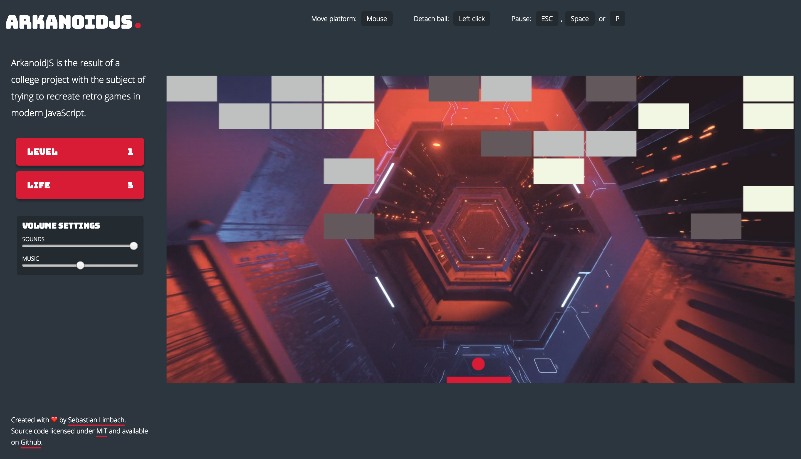

# ArkanoidJS 
> :warning: This is a work in progress project! It may not represent the finished product or work at all.

ArkanoidJS is the result of a college project with the subject of trying to recreate retro games in modern JavaScript.

## Try it out
- On the project website: [https://sebastianlimbach.com/ArkanoidJS](https://sebastianlimbach.com/ArkanoidJS)

- Using the [docker image](https://hub.docker.com/r/bastilimbach/arkanoidjs/): `docker run -d -p 80:80 --name arkanoidjs bastilimbach/arkanoidjs`
### Browser compatibility
ArkanoidJS should work on every modern Browser, which supports HTML5 and the canvas element. (Tested on Firefox 57, Chrome 62 and Safari 11)

## How to play
- Move paddle/platform: `Mouse X-axis`
- Detach ball from paddle: `Left click`
- Pause game: `ESC` `Space` `P`

## Build from source
To build this project from source you need to install [nodejs](https://nodejs.org/en/) and preferably [yarn](https://yarnpkg.com/en/).
1. Clone the project: `git clone https://github.com/bastilimbach/ArkanoidJS.git`
2. Install dependencies: `yarn install` or `npm install`
3. Start the development server: `yarn start` or `npm start`
4. Or build the files for deployment: `yarn build` or `npm run-script build` (Compiled files are located in the `dist` folder.)

## Asset licenses
This project wouldn't be possible without the people, who created the amazing assets which are used in this game. Thank you!
### Sounds
- [Select by NoiseForFun](http://www.noiseforfun.com/2012-sound-effects/select/) ([License](https://creativecommons.org/licenses/by-nd/3.0/))
- [Select 4 by NoiseForFun](http://www.noiseforfun.com/2012-sound-effects/select-04/) ([License](https://creativecommons.org/licenses/by-nd/3.0/))
### Music
- [Cartoon – Immortality (feat. Kristel Aaslaid) [Futuristik Remix]](http://nocopyrightsounds.co.uk/video/cartoon-immortality-feat-kristel-aaslaid-futuristik-remix/) ([License](http://nocopyrightsounds.co.uk/info/))
### Videos
- [BOX_BEAT](https://vimeo.com/243314781) ([License](http://beeple-crap.com/resources.php))
- [FIBER OPTICAL](https://vimeo.com/238083470) ([License](http://beeple-crap.com/resources.php))
- [CLEANROOM](https://vimeo.com/216168912) ([License](http://beeple-crap.com/resources.php))
- [HEXXX](https://vimeo.com/202376104) ([License](http://beeple-crap.com/resources.php))
- [CUTTT](https://vimeo.com/198338744) ([License](http://beeple-crap.com/resources.php))
- [t-hawk](https://vimeo.com/122100301) ([License](http://beeple-crap.com/resources.php))
- [XANNN](https://vimeo.com/165286507) ([License](http://beeple-crap.com/resources.php))

## Contribution
I'm happy to accept Pull Requests if you come up with some awesome new game features or bug fixes! Please be sure to run `yarn test` before you push your changes.

## License
[MIT](https://github.com/bastilimbach/ArkanoidJS/blob/master/LICENSE) :heart:
